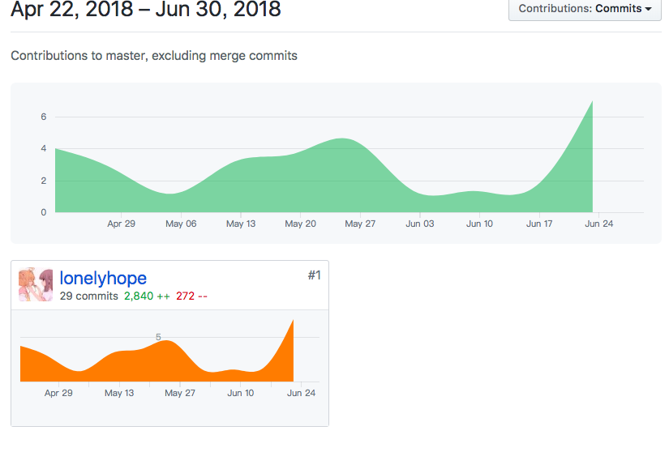

# 系分期末总结

15331341

1. 课程学习自我总结

   本次作业开发项目为 starpick，为一个类似 instagram 的开发项目，主要供用户发送图片。

   在项目中负责整个服务端的开发。采用 Python Django 框架，数据库为 sqlite。完成了整体项目的搭建、数据库的设计、与前端的交互及数据处理等基本功能。

   在完成本次课程作业的过程中，尝试进行了简单的数据库设计、学习了后端 Python 框架 Django 并以此实现了本次项目开发。

2. PSP 2.1 统计表

   | PSP阶段                    | 耗时(h) |
   | -------------------------- | ------- |
   | 计划                       | 8       |
   | 开发                       |         |
   | · 分析需求                 | 24      |
   | · 生成设计文档             | 18      |
   | · 设计复审                 | 8       |
   | · 代码规范                 | 2       |
   | · 具体设计                 | 8       |
   | · 具体编码                 | 4       |
   | · 代码复审                 | 4       |
   | · 测试                     | 8       |
   | 报告                       | 24      |
   | 事后总结，提出过程改进计划 | 8       |
   | 合计                       | 108     |

3. 个人分支的 GIT 统计报告

   

4. 自认为最得意/或有价值/或有苦劳的工作清单，含简短说明

   实现后端部分：

   - 后端框架的搭建
   - 数据库的设计
   - 实现具体功能：
     - 用户个人信息：用户注册、用户登录、用户修改个人信息
     - 图片相关：用户发布图片、用户评论图片
     - 用户互相关注：关注其他用户、获得关注者列表、获得关注列表
     - 踩或赞：用户为某幅图片点赞、取消赞、获取所有已赞图片、用户diss图片、用户取消diss图片、获得所有diss过的图片
     - HashTag：为图片添加HashTag、获取带有某HashTag的所有图片列表
     - 排行榜：按照图片被点赞的次数从高到低排序，按客户端要求返回前n项数据
   - 编写与前端交互的接口文档

5. 个人的技术类、项目管理类博客清单

   后端接口说明文档：https://github.com/starpick/serverCode/blob/master/README.md

   vue 学习文档：https://github.com/lonelyhope/SystemAnalyzeAndDesign/blob/master/hw3/hw3.md