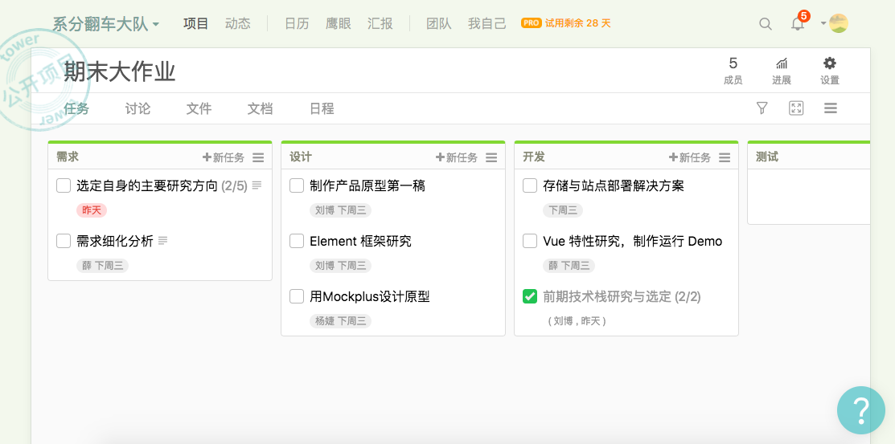

1、简答题

-  简述瀑布模型、增量模型、螺旋模型（含原型方法）的优缺点。

   **瀑布模型**：

   优点：

   1）为项目提供了按阶段划分的检查点

   2）当前一阶段完成后，您只需要去关注后续阶段。

   3）可在迭代模型中应用瀑布模型

   4）它提供了一个模板，这个模板使得分析、设计、编码、测试和支持的方法可以在该模板下有一个共同的指导。

   缺点：

   1）各个阶段的划分完全固定，阶段之间产生大量的文档，极大地增加了工作量。

   2）由于开发模型是线性的，用户只有等到整个过程的末期才能见到开发成果，从而增加了开发风险。

   3）通过过多的强制完成日期和里程碑来跟踪各个项目阶段。

   4）瀑布模型的突出缺点是不适应用户需求的变化。

   **增量模型**：

   优点：

   1、将待开发的软件系统模块化，可以分批次地提交软件产品，使用户可以及时了解软件项目的进展。

   2、以组件为单位进行开发降低了软件开发的风险。一个开发周期内的错误不会影响到整个软件系统。

   3、开发顺序灵活。开发人员可以对组件的实现顺序进行优先级排序，先完成需求稳定的核心组件。当组件的优先级发生变化时，还能及时地对实现顺序进行调整。

   缺点：

   要求待开发的软件系统可以被模块化。如果待开发的软件系统很难被模块化，那么将会给增量开发带来很多麻烦。

   **螺旋模型**：

   优点：

   1）设计上的灵活性,可以在项目的各个阶段进行变更

   2）以小的分段来构建大型系统,使成本计算变得简单容易。

   3）客户始终参与每个阶段的开发,保证了项目不偏离正确方向以及项目的可控性。

   4）随着项目推进,客户始终掌握项目的最新信息 , 从而他或她能够和管理层有效地交互。

   5）客户认可这种公司内部的开发方式带来的良好的沟通和高质量的产品。

   缺点：

   很难让用户确信这种演化方法的结果是可以控制的。建设周期长，而软件技术发展比较快，所以经常出现软件开发完毕后，和当前的技术水平有了较大的差距，无法满足当前用户需求。

   ​

-  简述 UP 的三大特点，其中哪些内容体现了用户驱动的开发，哪些内容体现风险驱动的开发？

   UP: The Unified Process (UP) represents a mainstream approach for software development across the spectrum of project scales. 

   **三大特点**：

   用例驱动、以架构为中心、迭代和进化

   用例驱动：采用用例来捕获对目标系统的功能需求，驱动软件的整个开发过程，保证需求的可跟踪性，确保系统所有功能均被实现。

   以架构为中心：在开发过程的早期，识别出软件与软件的体系结构紧密相关的用例，并通过对这些用例的分析、设计、实现和测试，形成体系结构框架；在后续阶段中对已形成的体系结构框架进行不断细化，最终实现整体系统;

   迭代和进化：整个开发工作被组织为一系列的短小的、固定长度（如3周）的小项目，被称为一系列的**迭代**。每一次迭代都包括了需求分析、设计、实现与测试。 每次迭代都选择目前对风险影响最大的用例进行，以分解和降低风险。

   **用户驱动开发**：用例驱动

   **风险驱动开发**：迭代和进化

   ​

   ​

-  UP 四个阶段的划分准则是什么？关键的里程碑是什么？

   四个阶段：

   1. 构思阶段 ：包括用户沟通和计划活动两个方面，强调定义和细化用例，并将其作为主要模型。

      里程碑: 生命周期目标 (Lifecycle Objective) 里程碑

   2. 细化阶段 ：包括用户沟通和建模活动，重点是创建分析和设计模型，强调类的定义和体系结构的表示。

      里程碑：生命周期体系结构 (Lifecycle Architecture) 里程碑。

   3. 构建阶段 ：将设计转化为实现，并进行集成和测试。

      里程碑：初始运行能力 (Initial Operational Capability) 里程碑。

   4. 移交阶段 ：将产品发布给用户进行测试评价，并收集用户的意见，之后再次进行迭代修改产品使之完善。

      里程碑：产品发布 (Product Release) 里程碑。

-  IT 项目管理中，“工期、质量、范围/内容” 三个元素中，在合同固定条件下，为什么说“范围/内容”是项目团队是易于控制的

   合同固定条件下，工期及对质量的要求确定后，范围和内容可以由团队自行控制。

-  为什么说，UP 为企业按固定节奏生产、固定周期发布软件产品提供了依据？

   UP中，软件开发生命周期根据时间（固定周期发布）和RUP的核心工作流（固定节奏生产）划分为二维空间。

2、项目管理使用

-  使用截图工具（png格式输出），展现你团队的任务 Kanban，请注意以下要求

   -  每个人的任务是明确的。即一周后可以看到具体成果
   -  每个人的任务是1-2项。
   -  至少包含一个团队活动任务

   