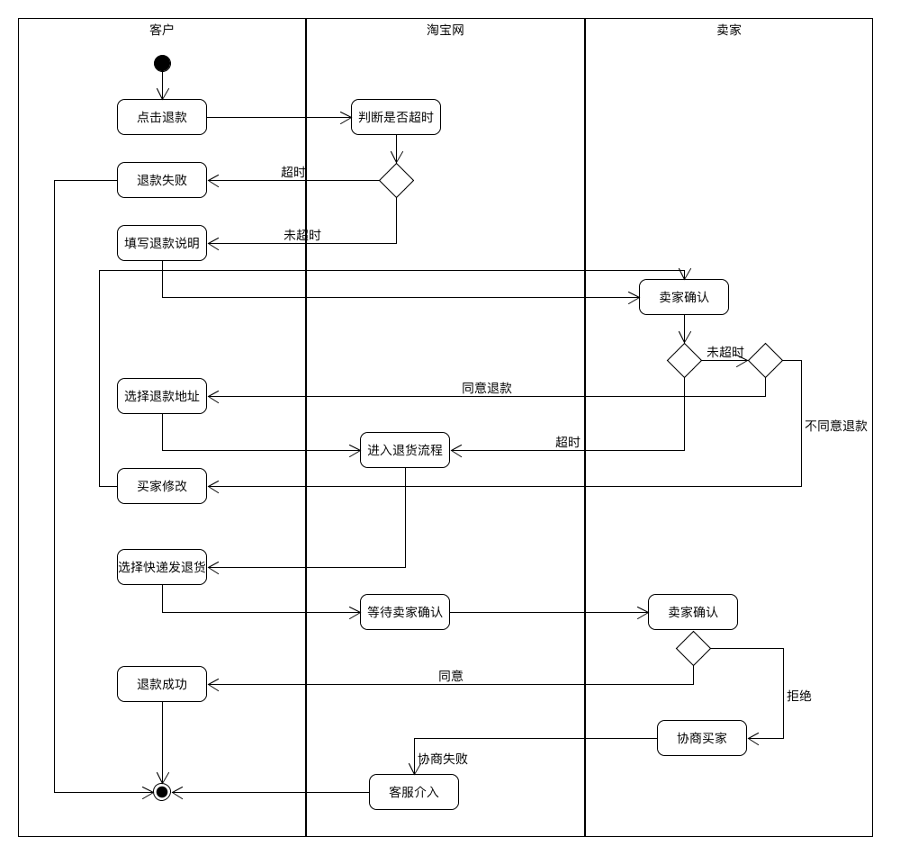

# 系统分析与设计·作业4

lesson 6

1. 用例建模

   - a. 阅读 Asg_RH 文档，绘制用例图。 按 Task1 要求，请使用工具 UMLet，截图格式务必是 png 并控制尺寸

     

   - b. 选择你熟悉的定旅馆在线服务系统（或移动 APP），如绘制用例图。并满足以下要求：
     \- 对比 Asg_RH 用例图，请用色彩标注出创新用例或子用例
     \- 尽可能识别外部系统，并用色彩标注新的外部系统和服务

     去哪儿酒店预订用例：

     

   - c. 对比两个时代、不同地区产品的用例图，总结在项目早期，发现创新的思路与方法

     考虑当前可用的技术，充分提高软件产品的便利性。如在搜索酒店时可以调用已有的 GPS API 如谷歌地图、百度地图等，使用户得到更好的用户体验；

     考虑地域特征；在进行支付时，除了使用传统的银行卡支付方式，可以考虑本地其他流行的支付方式，如在中国可以使用微信支付、支付宝支付等。

   - d. 请使用 SCRUM 方法，在（任务b）用例图基础上，编制某定旅馆开发的需求 （backlog）

     1. 用户注册、登录

     2. 酒店搜索：

        - 输入酒店地址、入住日期，进行搜索
        - 调用GPS API显示地图进行地址定位
        - 显示搜索结果页面并支持按不同指标进行排序

     3. 用户预订酒店：

        - 用户在搜索页面选定酒店，跳转到酒店详情页面，显示房间情况和价格等
        - 用户选择预订方案，提供用户信息（姓名、手机号等）

     4. 用户付款

        跳转到付款页面，提供不同付款方式：信用卡支付、微信支付、支付宝支付、财付通支付

        预订成功后向用户发送预订成功信息

2. 业务建模

   - a. 在（任务b）基础上，用活动图建模找酒店用例。简述利用流程图发现子用例的方法。

     

     活动图中的状态通常可以作为子用例。

   - b. 选择你身边的银行 ATM，用活动图描绘取款业务流程

     

   - c. 查找淘宝退货业务官方文档，使用多泳道图，表达客户、淘宝网、淘宝商家服务系统、商家等用户和系统协同完成退货业务的过程。分析客户要完成退货业务，在淘宝网上需要实现哪些系统用例

     

     系统用例：

     客户发起退款

     客户修改退款信息

     卖家确认退款信息

     客户执行退货

     卖家确认退货

3. 用例文本编写

   - 在大作业基础上，分析三种用例文本的优点和缺点

     Biref：

     - 优点：能够快速浏览多个产品的主要功能；描述简洁，可以大致了解产品概况；编写速度快，适合用于小组会议的讨论；
     - 缺点：没有对使用场景细致的流程化描述，作为开发指导显得过于粗略，容易造成开发过程中的不一致性

     Casual:

     - 优点：比起Brief用例更为详细；展示形式丰富，结合活动图、UI图等更直观地表示用例；考虑交替场景，用例更全面；适合用于早期开发
     - 缺点：没有在操作上做更细节的考虑；不够正式

     Full:

     - 优点：考虑全面，考虑到了多个场景及拓展功能，考虑了系统涉及的每个角色，适合实际开发时使用。
     - 缺点：编写耗时，条目多，较繁琐