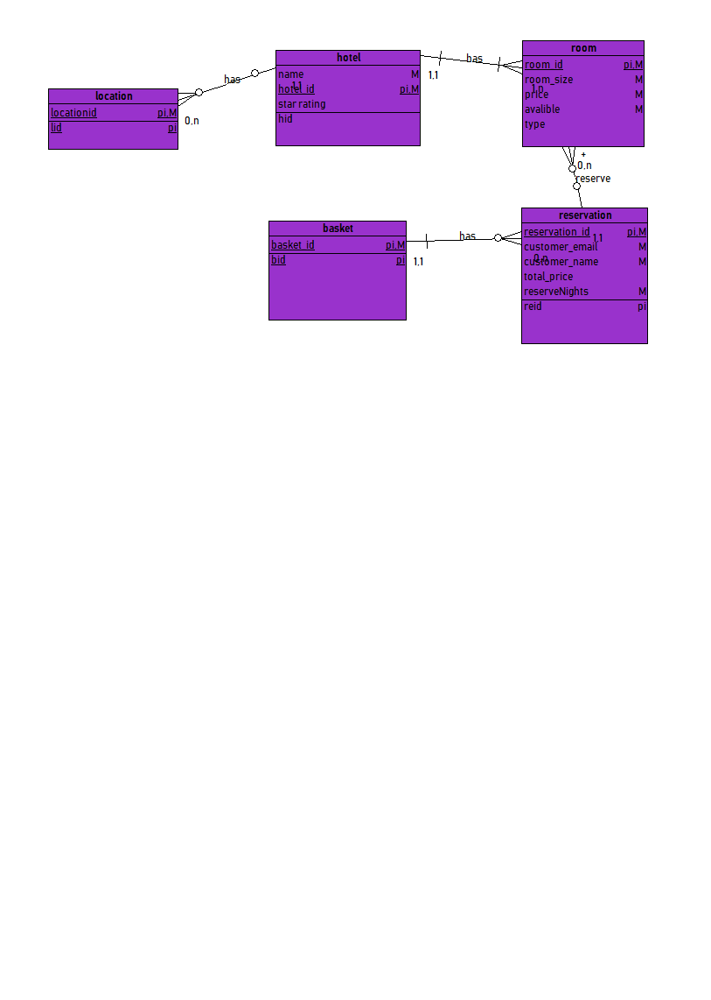

# 系统分析与设计·lesson 7

领域建模

1. 阅读 Asg_RH 文档，**按用例**构建领域模型。

   

2. 数据库建模(E-R 模型)

   数据库逻辑模型 与 领域模型 的异同:

   数据模型是系统设计，以及实现的一部分，描述的是对用户需求在技术上的实现方法。数据库模型是用于设计数据库、直接指导开发的，它要求明确属性的类型、大小及类之间的具体关系，更接近程序设计。

   领域模型描述的是业务中涉及到的业务实体以及相互之间的关系。因此它可以帮助需求分析人员和用户（或用户代表）认识实际业务，从而成为需求分析人员和用户之间交流的重要工具，是他们共同理解的概念，是彼此交流的语言。 领域模型更加抽象，它不需要对数据和属性有精确的描述，也不涉及任何编程相关，如数据存储方式等等。

   用户不需要关心系统的数据模型，但是必须关注领域模型，因为领域模型反映的是问题域的相关业务概念以及其关系，领域模型是用户业务描述的高度抽象，来源于业务需求的描述，同时又可以帮助用户和需求分析人员更好的理解业务需求。

   脚本：

   ```sql
   -- +---------------------------------------------------------
   -- | MODEL       : task3
   -- | AUTHOR      : 
   -- | GENERATED BY: Open System Architect
   -- +---------------------------------------------------------
   -- | WARNING     : Review before execution
   -- +---------------------------------------------------------

   -- +---------------------------------------------------------
   -- | CREATE
   -- +---------------------------------------------------------
   CREATE TABLE basket
   (
     basket_id integer NOT NULL,
     PRIMARY KEY (basket_id)
   );
   CREATE TABLE reservation
   (
     reservation_id integer NOT NULL,
     customer_email character(100) NOT NULL,
     customer_name character(100) NOT NULL,
     total_price double precision,
     reserveNights integer NOT NULL,
     basket_id integer NOT NULL,
     PRIMARY KEY (reservation_id)
   );
   CREATE INDEX idxreservation1 ON reservation
   (
     basket_id
   );

   CREATE TABLE room
   (
     room_id integer NOT NULL,
     room_size integer NOT NULL,
     price double precision NOT NULL,
     avalible character varying(10) NOT NULL,
     type character varying(100),
     reservation_id integer NOT NULL,
     PRIMARY KEY (room_id)
   );
   CREATE INDEX idxroom1 ON room
   (
     reservation_id
   );

   CREATE TABLE hotel
   (
     name character varying(100) NOT NULL,
     hotel_id integer NOT NULL,
     star_rating character varying(10),
     PRIMARY KEY (hotel_id)
   );
   CREATE TABLE location
   (
     locationid integer NOT NULL,
     PRIMARY KEY (locationid)
   );
   ALTER TABLE location ADD CONSTRAINT has
     FOREIGN KEY (  )
      REFERENCES hotel (  )
       NOT DEFERRABLE;
   ALTER TABLE hotel ADD CONSTRAINT has
     FOREIGN KEY (  )
      REFERENCES room (  )
       NOT DEFERRABLE;
   ALTER TABLE room ADD CONSTRAINT reserve
     FOREIGN KEY ( reservation_id )
      REFERENCES reservation ( reservation_id )
       NOT DEFERRABLE;
   ALTER TABLE reservation ADD CONSTRAINT has
     FOREIGN KEY ( basket_id )
      REFERENCES basket ( basket_id )
       NOT DEFERRABLE;

   ```

   

   ​

   ​

