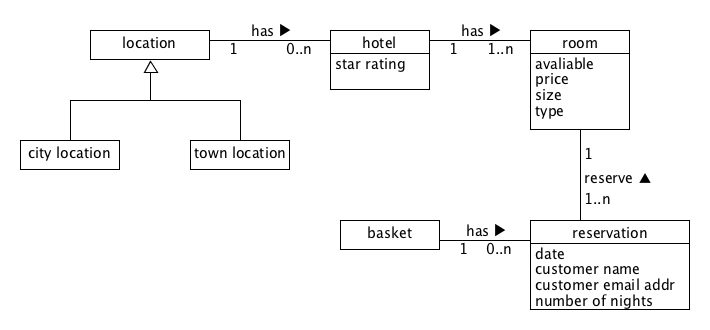
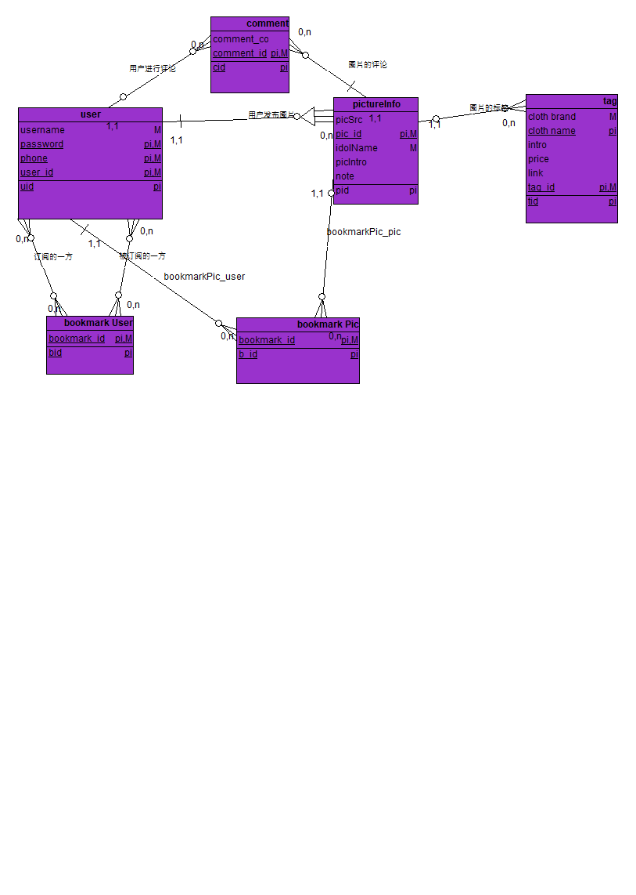

# 系统分析与设计·lesson 7

领域建模

1. 阅读 Asg_RH 文档，**按用例**构建领域模型。

   

2. 数据库建模(E-R 模型)

   数据库逻辑模型 与 领域模型 的异同:

   数据模型是系统设计，以及实现的一部分，描述的是对用户需求在技术上的实现方法。数据库模型是用于设计数据库、直接指导开发的，它要求明确属性的类型、大小及类之间的具体关系，更接近程序设计。

   领域模型描述的是业务中涉及到的业务实体以及相互之间的关系。因此它可以帮助需求分析人员和用户（或用户代表）认识实际业务，从而成为需求分析人员和用户之间交流的重要工具，是他们共同理解的概念，是彼此交流的语言。 领域模型更加抽象，它不需要对数据和属性有精确的描述，也不涉及任何编程相关，如数据存储方式等等。

   用户不需要关心系统的数据模型，但是必须关注领域模型，因为领域模型反映的是问题域的相关业务概念以及其关系，领域模型是用户业务描述的高度抽象，来源于业务需求的描述，同时又可以帮助用户和需求分析人员更好的理解业务需求。

   脚本：

   ```sql
   CREATE TABLE user
   (
     username  NOT NULL,
     password  NOT NULL,
     phone  NOT NULL,
     user_id  NOT NULL,
     PRIMARY KEY (password,phone,user_id)
   );
   CREATE TABLE bookmark_Pic
   (
     Pic_bookmark_id  NOT NULL,
     user_id  NOT NULL,
     PRIMARY KEY (Pic_bookmark_id)
   );
   COMMENT ON TABLE bookmark_Pic IS '??????';
   CREATE INDEX idxbookmark_Pic1 ON bookmark_Pic
   (
     user_id
   );

   CREATE TABLE pictureInfo
   (
     picSrc ,
     pic_id  NOT NULL,
     idolName  NOT NULL,
     picIntro ,
     note ,
     user_id  NOT NULL,
     Pic_bookmark_id  NOT NULL,
     PRIMARY KEY (pic_id,idolName)
   );
   COMMENT ON TABLE pictureInfo IS '?????????';
   CREATE INDEX idxpictureInfo1 ON pictureInfo
   (
     user_id
   );

   CREATE INDEX idxpictureInfo2 ON pictureInfo
   (
     Pic_bookmark_id
   );

   CREATE TABLE comment
   (
     comment_content ,
     comment_id  NOT NULL,
     user_id  NOT NULL,
     pic_id  NOT NULL,
     PRIMARY KEY (comment_id)
   );
   COMMENT ON TABLE comment IS '????????';
   CREATE INDEX idxcomment1 ON comment
   (
     user_id
   );

   CREATE INDEX idxcomment2 ON comment
   (
     pic_id
   );

   CREATE TABLE tag
   (
     cloth_brand  NOT NULL,
     cloth_name ,
     intro ,
     price ,
     link ,
     tag_id  NOT NULL,
     pic_id  NOT NULL,
     PRIMARY KEY (cloth_brand,tag_id)
   );
   COMMENT ON TABLE tag IS '????';
   CREATE INDEX idxtag1 ON tag
   (
     pic_id
   );

   CREATE TABLE bookmark_User
   (
     user_bookmark_id  NOT NULL,
     PRIMARY KEY (user_bookmark_id)
   );
   COMMENT ON TABLE bookmark_User IS '????';
   CREATE TABLE bookmarkUser_book
   (
     user_id  NOT NULL,
     user_bookmark_id  NOT NULL
   );
   CREATE INDEX idxbookmarkUser_book1 ON bookmarkUser_book
   (
     user_id
   );

   CREATE INDEX idxbookmarkUser_book2 ON bookmarkUser_book
   (
     user_bookmark_id
   );

   CREATE TABLE bookmarkUser_booked
   (
     user_id  NOT NULL,
     user_bookmark_id  NOT NULL
   );
   CREATE INDEX idxbookmarkUser_booked1 ON bookmarkUser_booked
   (
     user_id
   );

   CREATE INDEX idxbookmarkUser_booked2 ON bookmarkUser_booked
   (
     user_bookmark_id
   );

   ALTER TABLE pictureInfo ADD CONSTRAINT publish
     FOREIGN KEY ( user_id )
      REFERENCES user ( user_id )
       NOT DEFERRABLE;
   ALTER TABLE comment ADD CONSTRAINT make_comment
     FOREIGN KEY ( user_id )
      REFERENCES user ( user_id )
       NOT DEFERRABLE;
   ALTER TABLE comment ADD CONSTRAINT pic_comments
     FOREIGN KEY ( pic_id )
      REFERENCES pictureInfo ( pic_id )
       NOT DEFERRABLE;
   ALTER TABLE tag ADD CONSTRAINT pics_tags
     FOREIGN KEY ( pic_id )
      REFERENCES pictureInfo ( pic_id )
       NOT DEFERRABLE;
   ALTER TABLE bookmark_Pic ADD CONSTRAINT bookmarkPic_user
     FOREIGN KEY ( user_id )
      REFERENCES user ( user_id )
       NOT DEFERRABLE;
   ALTER TABLE pictureInfo ADD CONSTRAINT bookmarkPic_pic
     FOREIGN KEY ( Pic_bookmark_id )
      REFERENCES bookmark_Pic ( Pic_bookmark_id )
       NOT DEFERRABLE;
   ALTER TABLE bookmarkUser_book ADD CONSTRAINT bookmarkUser_book
     FOREIGN KEY ( user_id )
      REFERENCES user ( user_id )
       NOT DEFERRABLE;
   ALTER TABLE bookmarkUser_booked ADD CONSTRAINT bookmarkUser_booked
     FOREIGN KEY ( user_id )
      REFERENCES user ( user_id )
       NOT DEFERRABLE;
   ```

   

   ​

   ​

