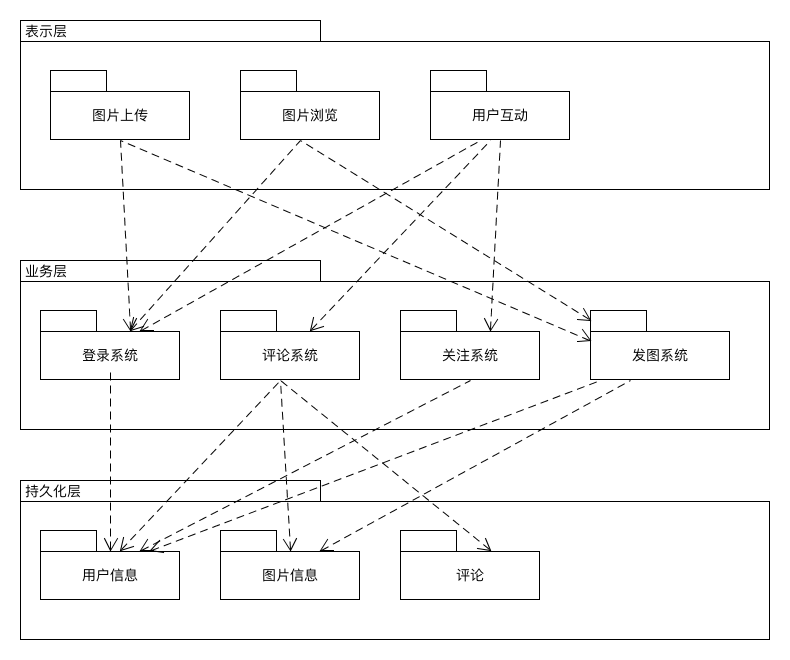
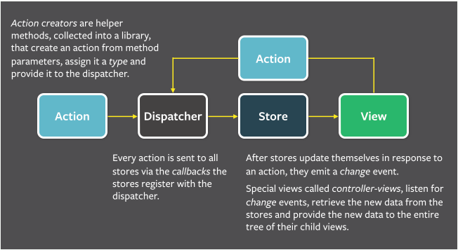
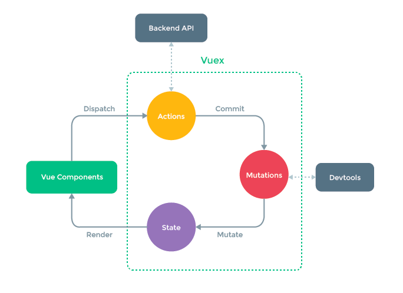

# lesson13·系统分析与设计

1. 描述软件架构与框架之间的区别与联系

   - 软件架构：**软件架构**是有关软件整体结构与组件的抽象描述，用于指导大型软件系统各个方面的设计。软件架构描述的对象是直接构成系统的抽象组件。各个组件之间的连接则明确和相对细致地描述组件之 间的通讯。

   - 软件框架：软件框架是面向领域（如 ERP、计算领域等）的、可复用的“半成品”软件，它实现了该领域的共性部分，并提供了一些定义良好的可变点以保证灵活性和可扩展性。也就是说软件框架是领域分析结果的软件化，是领域内最终应用的模板。

   - 区别：框架是软件，架构不是软件。

     框架是一种特殊的软件，它并不能提供完整无缺的解决方案，而是为你构建解决方案提供良好的基础。框架是半成品。典型地，框架是系统或子系统的半成品；框架中的服务可以被最终应用直接调用，而框架中的扩展点是供应用开发人员定制的“可变化点”。

     软件架构不是软件，而是关于软件如何设计的重要决策。软件架构决策涉及到如何将软件系统分解成不同的部分、各部分之间的静态结构关系和动态交互关系等。经过完整的开发过程之后，这些架构决策将体现在最终开发出的软件系统中；引入软件框架之后，整个开发过程变成了“分两步走”，而架构决策往往会体现在框架之中。

   - 联系：软件框架是指在一定的设计原则基础上，从不同角度对组成系统的各部分进行搭配和安排，形成系统的多个结构而组成架构，它包括该系统的各个组件，组件的外部可见属性及组件之间的相互关系。组件的外部可见属性是指其他组件对该组件所做的假设。

2. 以你的项目为案例

   - 绘制三层架构模型图，细致到分区

     

   - 结合你程序的结构，从程序员角度说明三层架构给开发者带来的便利

     便利：

     分三层架构能够更好的体现了“高内聚，低耦合”的思想，从而达到解耦的目的，实现软件各部分各司其职，一方的变化基本不会影响到另一方，只需要在对接初稍作修改就可以了。开发人员可以只关注整个结构中的其中某一层；可以很容易的用新的实现来替换原有层次的实现；可以降低层与层之间的依赖；有利于标准化；利于各层逻辑的复用。结构更加的明确；在后期维护的时候，极大地降低了维护成本和维护时间。

3. 研究 VUE 与 Flux 状态管理的异同

   - flux

     Flux 的思维方式是单向的，将之前放权到各个组件的修改数据层的 `controller` 代码收归一处，统一管理，组件需要修改数据层的话需要去触发特定的预先定义好的 `dispatcher`，然后 `dispatcher` 将 `action` 应用到 `model` 上，实现数据层的修改。然后数据层的修改会应用到视图上，形成一个单向的数据流。

     下图中，通过 `Dispatcher`，用户可以注册需要相应的 `action` 类型，对不同的 `action` 注册对应的回调，以及触发 `action` 并传递 `payload` 数据。

     

   - vue

     vue的Action和mutation均可对state进行改动，一般在action中提交mutation，在action中实现异步逻辑，mutation只支持同步逻辑。

     

   - 相同点：都使用了MVVC的设计思想，将对数据的管理交付给一个“管理员”，数据的变化控制视图的变化，视图的变化可以引起数据的变化并最终应用到视图上。使得对视图和数据的管理更加有序和方便。

   - 不同点：

     - flux不区分同步和异步更改， 而Vuex区分， commit时同步更新, action是异步更新。
     - Vuex的更新是直接通过state实例，作为state方法来调用，而flux的action由view提交后，通过dispatch分发到store更新，然后再通知view更新。

   