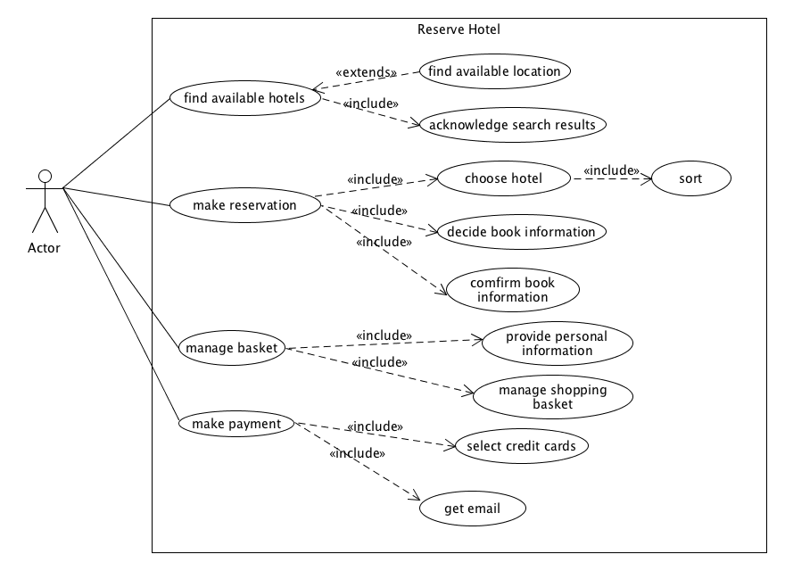
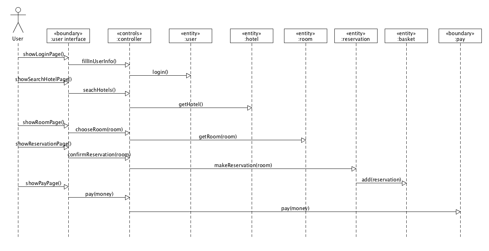
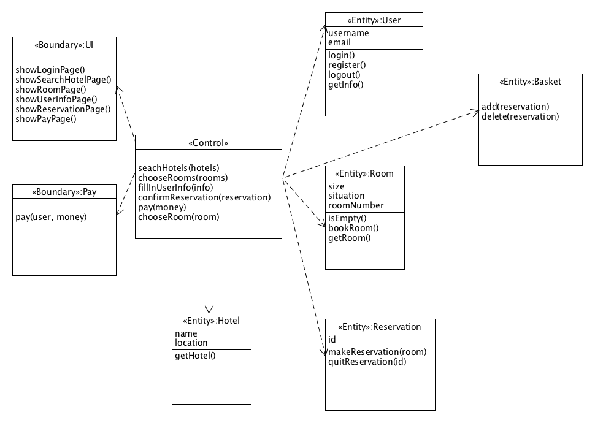
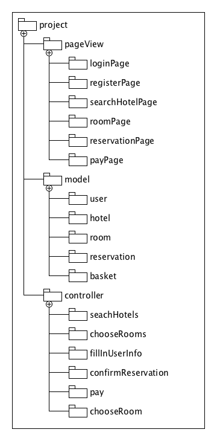

# 系分·lesson 16

## 使用 ECB 实现 make reservation 用例的详细设计（包含用例简介，顺序图，类图）

1. 用例简介

   make reservation：用户搜寻酒店、选定酒店 --> 选择房间、日期、生成订单 --> 填写必要信息 --> 付款

   用例图：

   

   BCE 类：

   - UI类：HotelSearchPage、hotelResultPage、RoomInfoPage、BasketPage、payPage
   - Controller 类：
     - input 类：处理页面输入（表单填写）
     - click 类：处理鼠标点击
   - Entity 类：location、hotel、room、reservation、basket

2. 顺序图

   

3. 类图

   

## 将逻辑设计类图映射到实际项目框架的包图。用树形结构表述实现的包和类

项目框架：

